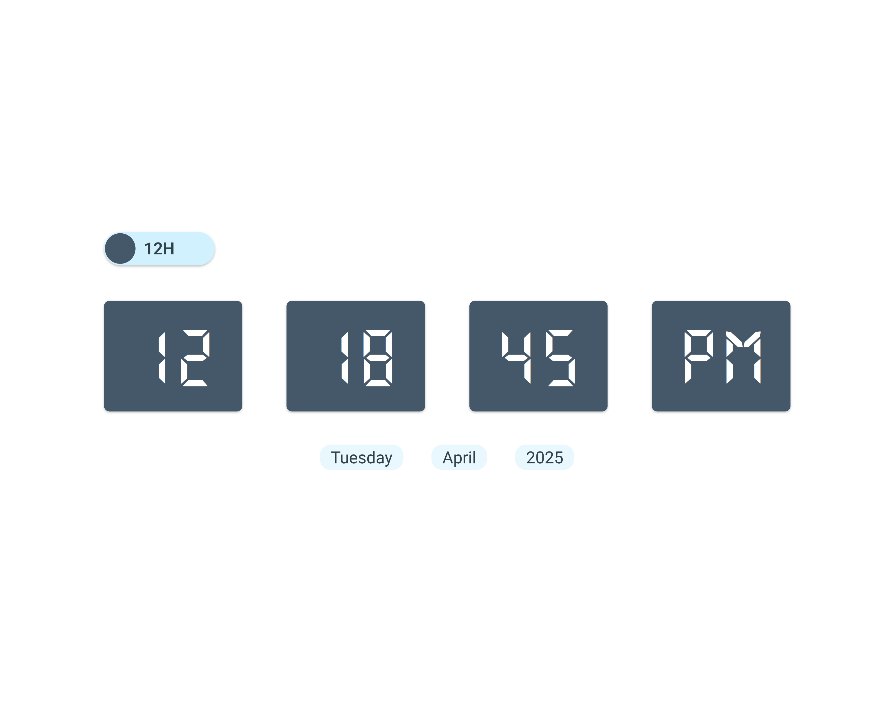
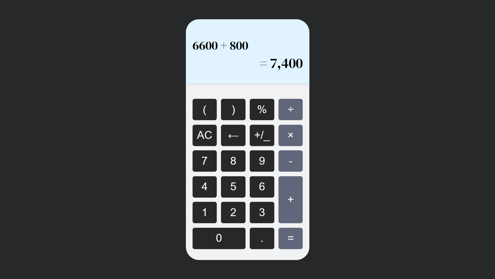

# 100 JavaScript Mini Projects

This repository contains a collection of 100 mini JavaScript projects. These projects aim to help you learn and practice JavaScript in a fun and interactive way. Each project is designed to improve your understanding of core JavaScript concepts, DOM manipulation, and web development techniques.

## Projects List

### 1. Counter App

    

   - **Description**: A simple counter app where you can increment and decrement a counter with buttons.  
   - **Repo**: [Counter App](https://github.com/habibjx/JavaScript-100-Mini-Projects/tree/main/Counter-App)
   - **Live View**: [Counter App](https://counter-app-habibjx.netlify.app/)

### 2. Digital Clock

    

  - **Description**: This real-time digital clock is built using JavaScript and updates every second. It supports both **12-hour** and **24-hour** formats, allowing users to switch between them. The clock also displays the **current date** for a complete time-tracking experience.
  - **Repo**: [Digital Clock](https://github.com/habibjx/JavaScript-100-Mini-Projects/tree/main/Digita-Clock)
  - **Live View**: [Digital Clock](https://digita-clock-habibjx.netlify.app/)

**Features**  
- ⏳ **Real-time updates** – Refreshes every second.  
- 🕒 **12-hour & 24-hour mode** – Switch between AM/PM and 24-hour format.  
- 📅 **Date display** – Shows the current date.  
- 🎨 **User-friendly design** – Simple and clean interface.  

This project is a great way to practice **JavaScript's Date object**, **DOM manipulation**, and **real-time updates**. 🚀  

### 3. To Do List Web Application

    

   - **Description**: This is a clean, minimalistic Todo App built with vanilla JavaScript, HTML, and CSS. It is designed to be lightweight yet functional, with a focus on user experience and performance.
   - **Repo**: [Digital Clock](https://github.com/habibjx/JavaScript-100-Mini-Projects/tree/main/To-do-list)
  - **Live View**: [Digital Clock](https://to-do-list-habibjx.netlify.app/)

  **Features**  
   - Add new to-dos by typing and clicking the **Add Todo** button.
   - Press **Enter** to quickly add a task without clicking the button.
   - Mark tasks as complete using the checkbox.
   - On **hover**, a delete button appears to remove a specific task. 
   - To-dos are saved in **localStorage**, so data will remain even after refreshing the page.
   - Clean and modern UI with a focus on usability.

   ## Tech Stack
   - HTML
   - CSS
   - JavaScript (DOM Manipulation)
   - LocalStorage
### 4. Simple Calculator

    

   - **Description**: I just built a basic yet functional calculator using HTML, CSS, and JavaScript! This project helped me understand DOM manipulation, event handling, and basic logic building in JavaScript.
   - **Repo**: [Calculator](https://github.com/habibjx/JavaScript-100-Mini-Projects/tree/main/Calculator)
  - **Live View**: [Calculator](https://calculator-habibjx.netlify.app/)

  **Features**  
   - Perform basic arithmetic operations: Addition, Subtraction, Multiplication, Division.
   - Clear and Delete functionality.
   - Responsive design for mobile and desktop.
   - Clean and user-friendly UI
   - Built with vanilla JavaScript (no external libraries).
   - Used eval() for expression evaluation (used only for learning purpose; planning to replace with a safer alternative in future projects).

### 5. Random Color Generator

    

   - **Description**: I created a random color generator using HTML, CSS, and JavaScript! The app generates a random color and displays it in a card-like container with both RGB and Hex color codes. You can easily copy the color codes by clicking on them, and a toast message will appear to confirm the action.
   - **Repo**: [Random Color Generator](https://github.com/habibjx/JavaScript-100-Mini-Projects/tree/main/random-color-generator)
  - **Live View**: [Random Color Generator](https://random-color-generator-habibjx.netlify.app/)

  **Features**  
   - Random color generation.
   - Display of both RGB and Hex codes.
   - Copy color codes with a click.
   - Predefined color boxes for easy color selection.
   - Interactive toast message for feedback.

### 6. Text Analyzer

   

   - **Description**: Text Analyzer is a simple yet powerful tool that helps you analyze your written content instantly. It automatically detects the total number of words, characters, the longest word, and the most frequently used word. Whether you're a content writer, student, or developer, this tool is perfect for quickly evaluating your text.

   - **Repo**: [Text Analyzer](https://github.com/habibjx/JavaScript-100-Mini-Projects/tree/main/Text-Analyzer)
   - **Live View**: [Text Analyzer](https://text-analyzer-habibjx.netlify.app/)

   **Features**
   - Total Word Count: Instantly shows how many words are in the text.
   - Total Character Count: Displays the total number of characters, including spaces.
   - Longest Word Finder: Identifies the longest word in the text.
   - Most Frequent Word: Finds the word that appears most often.
   - Real-Time Analysis: Get instant feedback as you type or paste your text.
   - User-Friendly Interface: Clean and easy to use for everyone.

### 7. Tips Calculator

   

   - **Description** A simple and interactive Tips Calculator that helps users calculate the per-person cost of a bill, including tips, based on the total bill amount, number of people, and selected tip percentage. This tool ensures a smooth user experience with error handling, reset functionality, and final payment confirmation alerts.

   - **Repo**: [Text Analyzer](https://github.com/habibjx/JavaScript-100-Mini-Projects/tree/main/tips-calculator)
   - **Live View**: [Text Analyzer](https://tips-calculator-habibjx.netlify.app/)

    **Features**
   - Bill Amount Input – Easily input the total bill.
   - Number of People Input – Share the bill between any number of people.
   - Tip Percentage Selection – Choose or enter a custom tip percentage.
   - Per Person Calculation – Automatically displays the tip amount and total per person.
   - Validation Error Messages – Shows alerts if any input is missing or invalid.
   - Reset Button – Clears all inputs and outputs with a single click.
   - Pay Button – Confirms the transaction. If fields are empty, alerts the user to fill them.
   - Completion Alert – Notifies when all fields are correctly filled and calculation is complete.

