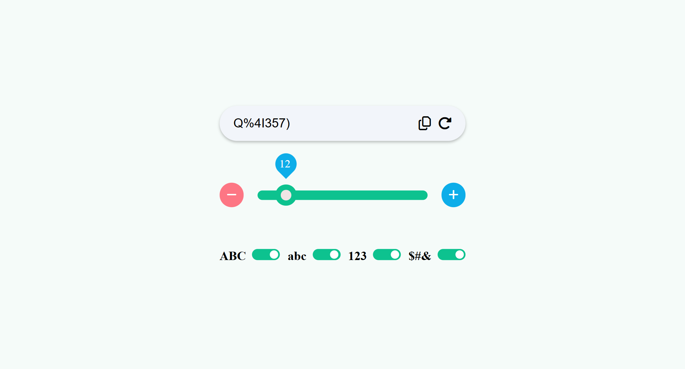

# 100 JavaScript Mini Projects

This repository contains a collection of 100 mini JavaScript projects. These projects aim to help you learn and practice JavaScript in a fun and interactive way. Each project is designed to improve your understanding of core JavaScript concepts, DOM manipulation, and web development techniques.

## Projects List

### 1. Counter App

    

   - **Description**: A simple counter app where you can increment and decrement a counter with buttons.  
   - **Repo**: [Counter App](https://github.com/habibjx/JavaScript-100-Mini-Projects/tree/main/Counter-App)
   - **Live View**: [Counter App](https://counter-app-habibjx.netlify.app/)

### 2. Digital Clock

    

  - **Description**: This real-time digital clock is built using JavaScript and updates every second. It supports both **12-hour** and **24-hour** formats, allowing users to switch between them. The clock also displays the **current date** for a complete time-tracking experience.
  - **Repo**: [Digital Clock](https://github.com/habibjx/JavaScript-100-Mini-Projects/tree/main/Digita-Clock)
  - **Live View**: [Digital Clock](https://digita-clock-habibjx.netlify.app/)

**Features**  
- ⏳ **Real-time updates** – Refreshes every second.  
- 🕒 **12-hour & 24-hour mode** – Switch between AM/PM and 24-hour format.  
- 📅 **Date display** – Shows the current date.  
- 🎨 **User-friendly design** – Simple and clean interface.  

This project is a great way to practice **JavaScript's Date object**, **DOM manipulation**, and **real-time updates**. 🚀  

### 3. To Do List Web Application

    

   - **Description**: This is a clean, minimalistic Todo App built with vanilla JavaScript, HTML, and CSS. It is designed to be lightweight yet functional, with a focus on user experience and performance.
   - **Repo**: [Digital Clock](https://github.com/habibjx/JavaScript-100-Mini-Projects/tree/main/To-do-list)
  - **Live View**: [Digital Clock](https://to-do-list-habibjx.netlify.app/)

  **Features**  
   - Add new to-dos by typing and clicking the **Add Todo** button.
   - Press **Enter** to quickly add a task without clicking the button.
   - Mark tasks as complete using the checkbox.
   - On **hover**, a delete button appears to remove a specific task. 
   - To-dos are saved in **localStorage**, so data will remain even after refreshing the page.
   - Clean and modern UI with a focus on usability.

   ## Tech Stack
   - HTML
   - CSS
   - JavaScript (DOM Manipulation)
   - LocalStorage
### 4. Simple Calculator

    

   - **Description**: I just built a basic yet functional calculator using HTML, CSS, and JavaScript! This project helped me understand DOM manipulation, event handling, and basic logic building in JavaScript.
   - **Repo**: [Calculator](https://github.com/habibjx/JavaScript-100-Mini-Projects/tree/main/Calculator)
  - **Live View**: [Calculator](https://calculator-habibjx.netlify.app/)

  **Features**  
   - Perform basic arithmetic operations: Addition, Subtraction, Multiplication, Division.
   - Clear and Delete functionality.
   - Responsive design for mobile and desktop.
   - Clean and user-friendly UI
   - Built with vanilla JavaScript (no external libraries).
   - Used eval() for expression evaluation (used only for learning purpose; planning to replace with a safer alternative in future projects).

### 5. Random Color Generator

    

   - **Description**: I created a random color generator using HTML, CSS, and JavaScript! The app generates a random color and displays it in a card-like container with both RGB and Hex color codes. You can easily copy the color codes by clicking on them, and a toast message will appear to confirm the action.
   - **Repo**: [Random Color Generator](https://github.com/habibjx/JavaScript-100-Mini-Projects/tree/main/random-color-generator)
  - **Live View**: [Random Color Generator](https://random-color-generator-habibjx.netlify.app/)

  **Features**  
   - Random color generation.
   - Display of both RGB and Hex codes.
   - Copy color codes with a click.
   - Predefined color boxes for easy color selection.
   - Interactive toast message for feedback.

### 6. Text Analyzer

   

   - **Description**: Text Analyzer is a simple yet powerful tool that helps you analyze your written content instantly. It automatically detects the total number of words, characters, the longest word, and the most frequently used word. Whether you're a content writer, student, or developer, this tool is perfect for quickly evaluating your text.

   - **Repo**: [Text Analyzer](https://github.com/habibjx/JavaScript-100-Mini-Projects/tree/main/Text-Analyzer)
   - **Live View**: [Text Analyzer](https://text-analyzer-habibjx.netlify.app/)

   **Features**
   - Total Word Count: Instantly shows how many words are in the text.
   - Total Character Count: Displays the total number of characters, including spaces.
   - Longest Word Finder: Identifies the longest word in the text.
   - Most Frequent Word: Finds the word that appears most often.
   - Real-Time Analysis: Get instant feedback as you type or paste your text.
   - User-Friendly Interface: Clean and easy to use for everyone.

### 7. Tips Calculator

   

   - **Description** A simple and interactive Tips Calculator that helps users calculate the per-person cost of a bill, including tips, based on the total bill amount, number of people, and selected tip percentage. This tool ensures a smooth user experience with error handling, reset functionality, and final payment confirmation alerts.

   - **Repo**: [tips calculator](https://github.com/habibjx/JavaScript-100-Mini-Projects/tree/main/tips-calculator)
   - **Live View**: [tips calculator](https://tips-calculator-habibjx.netlify.app/)

   **Features**
   - Bill Amount Input – Easily input the total bill.
   - Number of People Input – Share the bill between any number of people.
   - Tip Percentage Selection – Choose or enter a custom tip percentage.
   - Per Person Calculation – Automatically displays the tip amount and total per person.
   - Validation Error Messages – Shows alerts if any input is missing or invalid.
   - Reset Button – Clears all inputs and outputs with a single click.
   - Pay Button – Confirms the transaction. If fields are empty, alerts the user to fill them.
   - Completion Alert – Notifies when all fields are correctly filled and calculation is complete.

### 8. Random Password Generator 

   

   - **Description** Just built a Random Password Generator using HTML, CSS, and JavaScript!
   This project is not just about generating random passwords—it’s fully interactive and user-friendly. From copy functionality to custom range sliders and toggle buttons for character types—every feature is designed to enhance the user experience.

   - **Repo**: [Random Password Generator](https://github.com/habibjx/JavaScript-100-Mini-Projects/tree/main/random-password-generator)
   - **Live View**: [Random Password Generator](https://random-password-generator-habibjx.netlify.app/)

   **Key Features:**
   -  Password displayed in an input box with:
      - Copy button (shows confirmation when clicked).
      - Regenerate button to generate a new password.
   -  Custom Range Slider (0-100) to set password length:
      - (+ -) buttons to increase/decrease the range.
      - Live display of current password length above the slider.
   - Character Type Toggle Buttons:
      - Uppercase.
      - Lowercase.
      - Numbers.
      - Symbols.

   - Smart logic ensures password only contains selected character types.

### 9. Stop Watch

   

   - **Description** This stopwatch is a simple and interactive timer application designed with a circular time display. The time is shown in a visually appealing circular layout. It features two main buttons: Start and Reset. When the Start button is clicked, the stopwatch begins counting and the button label changes to Pause. Clicking Pause stops the timer and toggles the button back to Start. Clicking the Reset button resets the timer to 00:00. It's ideal for use in web projects or personal practice.

   - **Repo**: [Stop Watch](https://github.com/habibjx/JavaScript-100-Mini-Projects/tree/main/stop-watch)
   - **Live View**: [Stop Watch](https://stop-watch-habibjx.netlify.app/)

   **Key Features:**
   - Circular time display.
   - Start/Pause toggle button.
   - Reset button to set time back to zero.
   - Responsive design for all screen sizes.
   - Clean and simple user interface.
   - Built using HTML, CSS, and JavaScript only.

### 10. Weather Application

   

   - **Description**  I’ve just built a Weather Application using a weather API!
   This simple yet functional project allows users to search any city and view real-time weather updates. It was a great opportunity to practice working with APIs and DOM manipulation. I'm constantly improving my skills in JavaScript and frontend development, and this project helped me explore real-world data handling.

   - **Repo**: [Weather Application](https://github.com/habibjx/JavaScript-100-Mini-Projects/tree/main/weather-application)
   - **Live View**: [Weather Application](https://weather-application-habibjx.netlify.app/)

   **Key Features:**
   - City search with both Search Icon and Enter key support.
   - Displays Temperature in Celsius.
   - Shows "Feels Like" (Real Feel) temperature.
   - Current Weather Condition (e.g., Clear, Rainy, Cloudy).
   -  Wind Speed, Humidity, and Cloudiness.
   - Shows current Date.
   -  Displays the City Name and Country Code (e.g., Dhaka, BD).

### 11. Random Joke Generator

   

   - **Description**  Check out my Random Joke Generator! Click the button, get a random joke, and a surprise "haha" emoji! Fun, simple, and a great way to bring some humor to your day. Built while practicing JavaScript!

   - **Repo**: [Joke Generator](https://github.com/habibjx/JavaScript-100-Mini-Projects/tree/main/random-joke-generator)
   - **Live View**: [Joke Generator](https://random-joke-generator-habibjx.netlify.app/)

   **Key Features:**
   - Random Joke Generation: Get a new joke each time you click the button.
   - Surprise "Haha" Emoji: Along with the joke, a random "haha" emoji will pop up to make it more fun!
   - Simple & Engaging: A user-friendly interface that ensures a delightful experience.
